# 🚚 Machine Learning-Based Late Delivery Risk Prediction in Global Supply Chain Operations

> An end-to-end Data Science and Machine Learning project that predicts late delivery risks and provides actionable supply chain insights through interactive analytics and dynamic visualizations.


---
## 🌐 Live Demo Links

### 🚀 Live Streamlit Dashboard

> Coming Soon (Will be updated after Streamlit deployment.)

---

## 📂 Dataset & Model Downloads

| Resource | Download Link |
|----------|--------------|
| APL Logistics Dataset (Original Dataset) | [*Download Link*](https://drive.google.com/file/d/1i7nnNwKP3P9PwuGZP5Do7jx1cBfgM47a/view?usp=drive_link) |
| Cleaned Supply Chain Dataset | [*Download Link*](https://drive.google.com/file/d/1awjAJyROUlLLfjT5cu4ptvN3A07nDg-h/view?usp=drive_link) |
| Random Forest Model (.pkl) | [*Download Link*](https://drive.google.com/file/d/1OQsEqjJrqw4Aa0gsXuprlwlvKaDpq1pI/view?usp=drive_link) |

> **Note**
>
> - Large datasets and trained Machine Learning models are hosted on Google Drive because of GitHub's file size limitations.
> - Download the required files before running the project locally.
> - Place both datasets inside the `data/` folder.
> - Place the Random Forest model file inside the `models/` folder.
> - The application is configured to automatically access these resources when required.

------
## 📌 Project Overview

Late deliveries significantly impact customer satisfaction, operational efficiency, and supply chain performance. This project leverages Machine Learning techniques to predict delivery delays and identify the key factors influencing delivery risks.

The solution combines data analytics, predictive modeling, and an interactive Streamlit dashboard to help stakeholders monitor supply chain performance and make informed business decisions.

### Key Highlights

- Predicts late delivery risks using Machine Learning.
- Performs comprehensive Exploratory Data Analysis (EDA).
- Identifies critical delivery-related factors affecting performance.
- Provides interactive business intelligence visualizations.
- Supports dynamic filtering and real-time analytical exploration.
- Offers actionable insights for supply chain optimization.

---
## 🎯 Business Problem

Supply chain disruptions and delayed deliveries can lead to:

- Increased operational costs.
- Reduced customer satisfaction.
- Inventory management challenges.
- Inefficient resource allocation.
- Revenue losses and reputational risks.

Organizations require intelligent systems capable of identifying potential delivery risks before they occur. This project addresses these challenges by building a predictive framework for late delivery risk assessment and business intelligence reporting.

---
## 🚀 Project Objectives

- Analyze supply chain delivery patterns.
- Predict the likelihood of late deliveries.
- Identify major factors influencing delivery risks.
- Discover trends across products and shipping methods.
- Build an interactive Streamlit dashboard for business users.
- Provide data-driven recommendations for supply chain optimization.

---
## 🛠️ Technologies Used

| Category | Tools & Libraries |
|----------|-----------------|
| Programming Language | Python 3.12 |
| Data Analysis | Pandas, NumPy |
| Data Visualization | Matplotlib, Plotly |
| Machine Learning | Scikit-Learn, XGBoost |
| Dashboard Development | Streamlit |
| Model Evaluation | Accuracy, Precision, Recall, F1-Score, ROC-AUC |
| Version Control | Git & GitHub |
| Development Environment | VS Code, Jupyter Notebook |

---
## 📂 Dataset Overview

| Attribute | Details |
|-----------|---------|
| Domain | Global Supply Chain Analytics |
| Dataset Type | Structured Tabular Data |
| Records | ~180,000+ |
| Features | Customer, Product, Sales, Shipping and Delivery Information |
| Target Variable | Late Delivery Risk |
| Project Type | Data Science and Machine Learning |

### Dataset Includes

- Product Information
- Customer Details
- Order Information
- Sales Metrics
- Shipping Details
- Delivery Status
- Geographic Information
- Discount and Quantity Details

---
## 🔄 Project Workflow

```text
                  Raw Dataset
                        │
                        ▼
                 Data Cleaning
                        │
                        ▼
               Exploratory Data Analysis
                        │
                        ▼
                 Feature Engineering
                        │
                        ▼
                  Data Preprocessing
                        │
                        ▼
                  Model Training
                        │
                        ▼
                  Model Evaluation
                        │
                        ▼
               Late Delivery Prediction
                        │
                        ▼
                Business Insights
                        │
                        ▼
               Interactive Dashboard
                        │
                        ▼
              Supply Chain Optimization
```

---
## 📊 Exploratory Data Analysis (EDA)

Exploratory Data Analysis was performed to understand customer behavior, product performance, sales trends, shipping patterns, and delivery risks across the supply chain.

### 1. Sales Distribution

<p align="center">
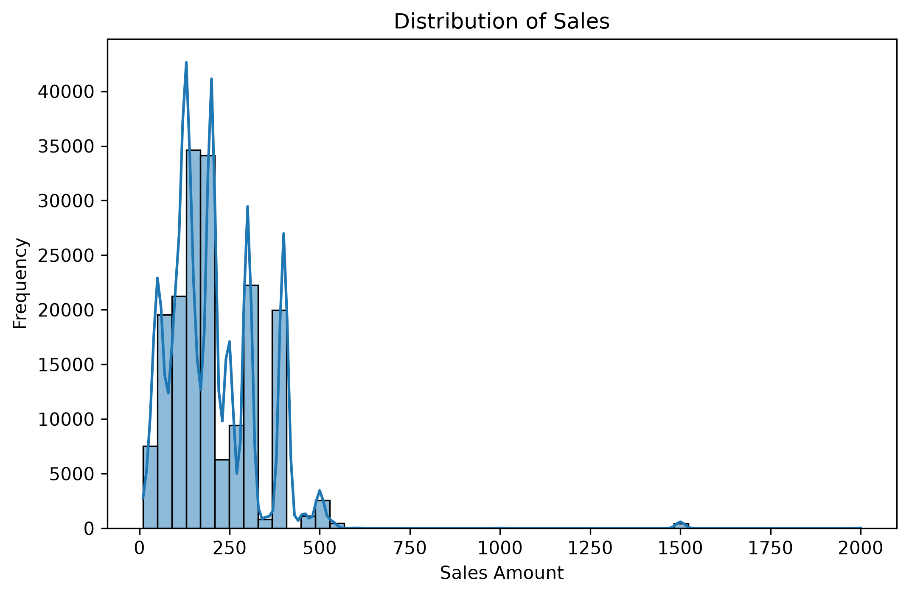
</p>

#### Key Insights

- Most orders fall within the low to medium sales range.
- High-value transactions are relatively less frequent.

> **Business Recommendation:** Focus inventory planning on frequently purchased products while monitoring premium products for profitability.

---

### 2. Distribution of Shipping Modes

<p align="center">
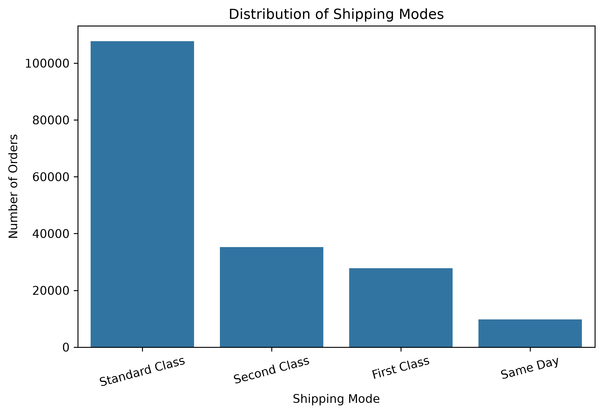
</p>

#### Key Insights

- Standard Class is the most preferred shipping method.
- Same Day deliveries account for a smaller portion of total orders.

> **Business Recommendation:** Optimize Standard Class logistics to improve operational efficiency and delivery performance.

---

### 3. Distribution of Scheduled Shipping Days

<p align="center">
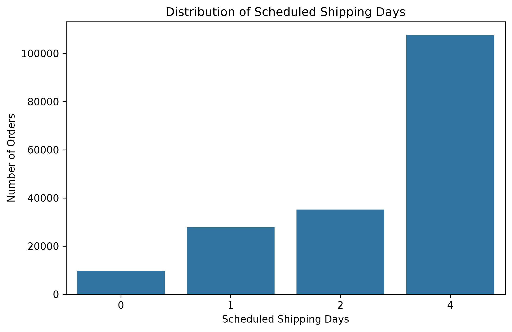
</p>

#### Key Insights

- Four-day scheduled deliveries dominate the dataset.
- Shorter delivery schedules are comparatively less common.

> **Business Recommendation:** Prioritize resource allocation for high-volume shipping schedules to minimize delivery delays.

---

### 4. Top Product Categories

<p align="center">

</p>

#### Key Insights

- Cleats and Men's Footwear contribute significantly to total orders.
- Electronics products represent a comparatively smaller share.

> **Business Recommendation:** Focus demand forecasting strategies on high-performing product categories.

---

### 5. Top Selling Products

<p align="center">
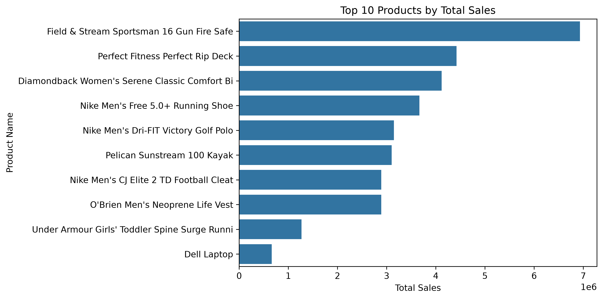
</p>

#### Key Insights

- A small group of products contributes substantially to overall sales.
- Product demand varies considerably across categories.

> **Business Recommendation:** Maintain adequate inventory levels for top-selling products to reduce stock-related delays.

---

### 6. Features Correlated with Late Delivery Risk

<p align="center">
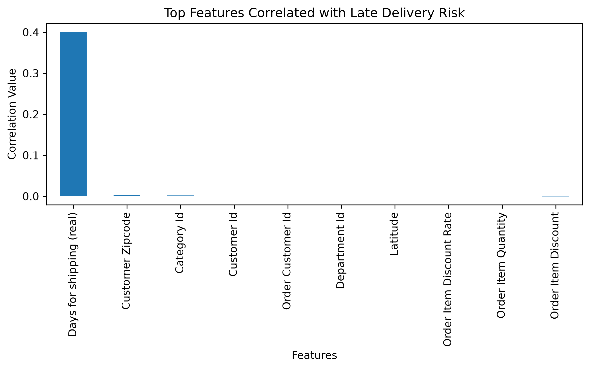
</p>

#### Key Insights

- Shipping-related variables exhibit the strongest relationship with delivery delays.
- Most customer-related attributes have relatively weak correlations.

> **Business Recommendation:** Improve shipping processes and delivery scheduling to effectively reduce late delivery risks.

---

## 🤖 Machine Learning Pipeline

The Machine Learning workflow follows a systematic pipeline for predicting late delivery risks and evaluating model performance.

```text
                    Raw Dataset
                         │
                         ▼
                  Data Preprocessing
                         │
                         ▼
                   Feature Selection
                         │
                         ▼
                    Data Splitting
                     (Train-Test)
                         │
                         ▼
                   Model Training
                         │
                         ▼
                 Model Evaluation
                         │
                         ▼
                 Late Delivery Prediction
                         │
                         ▼
                Risk Classification
                         │
                         ▼
               Business Recommendations
```

### Data Preprocessing

The preprocessing pipeline includes:

- Handling missing values.
- Feature engineering and feature selection.
- Encoding categorical variables.
- Scaling and transforming numerical features.
- Preparing data for Machine Learning models.

### Machine Learning Models

The following classification models were developed and evaluated:

| Model | Purpose |
|-------|---------|
| Random Forest Classifier | Late Delivery Risk Prediction |
| Logistic Regression | Baseline Classification Model |
| Gradient Boosting Classifier | Performance Comparison Model |

### Model Evaluation Metrics

The models were evaluated using:

- Accuracy Score
- Precision Score
- Recall Score
- F1-Score
- ROC-AUC Score
- Confusion Matrix Analysis
- ROC Curve Analysis

---
## 📈 Model Performance Evaluation

The trained Machine Learning models were compared to identify the most effective approach for predicting delivery delays.

### Evaluation Techniques

- Confusion Matrix Analysis
- ROC Curve Analysis
- Classification Metrics Comparison
- Business Impact Assessment

### Model Performance Includes

- Accuracy Comparison
- Precision Comparison
- Recall Comparison
- F1-Score Comparison
- ROC-AUC Comparison
- Best Performing Model Identification

### Performance Dashboard Features

- Dynamic Model Comparison
- Interactive Performance Visualizations
- Automated Best Model Selection
- Executive Level Business Insights

> **Business Value:** Accurate late delivery prediction enables proactive supply chain planning, reduced operational risks, and improved customer satisfaction.

---
## 💡 Key Business Insights

The analytical findings highlight several important supply chain patterns:

- Shipping strategies significantly influence delivery performance.
- Late delivery risks vary across markets, customer segments, and shipping methods.
- Product demand is concentrated among a limited number of categories and products.
- High-risk deliveries can be identified proactively using Machine Learning techniques.
- Dynamic analytics improve executive decision-making capabilities.

### Business Recommendations

- Optimize shipping schedules for high-risk deliveries.
- Improve inventory planning for high-demand products.
- Prioritize monitoring of high-risk markets and customer segments.
- Implement proactive delivery risk management strategies.
- Utilize predictive analytics to minimize operational disruptions.

---
## 🚀 Streamlit Dashboard Features

The project includes a fully interactive and dynamic multi-page Streamlit application designed for supply chain analytics, predictive intelligence, and executive-level business reporting.

### Dashboard Modules

| Module | Description |
|--------|-------------|
| Supply Chain Overview | Analyze sales performance, shipping trends, and supply chain operations. |
| Late Delivery Risk Prediction | Predict the probability of delivery delays using Machine Learning models. |
| Model Performance Dashboard | Compare model performance using classification metrics and visual analytics. |
| High Risk Intelligence Center | Identify high-risk markets, products, and shipping patterns contributing to delivery delays. |
| Business Intelligence Dashboard | Generate executive-level insights and business recommendations. |
| Project Resources Center | Access datasets, models, reports, graphs, and exported analytical outputs. |

---

### Key Dashboard Features

- Interactive and Dynamic Visualizations
- Real-Time Business Analytics
- Machine Learning-Based Risk Prediction
- Dynamic Filtering and Data Exploration
- Executive-Level Business Intelligence Reporting
- Downloadable Project Resources
- Model Performance Evaluation and Comparison
- Responsive and User-Friendly Interface

---
## 📸 Dashboard Preview

### Supply Chain Overview

> Provides a comprehensive overview of sales performance, markets, shipping methods, and late delivery trends across the supply chain.

<p align="center">
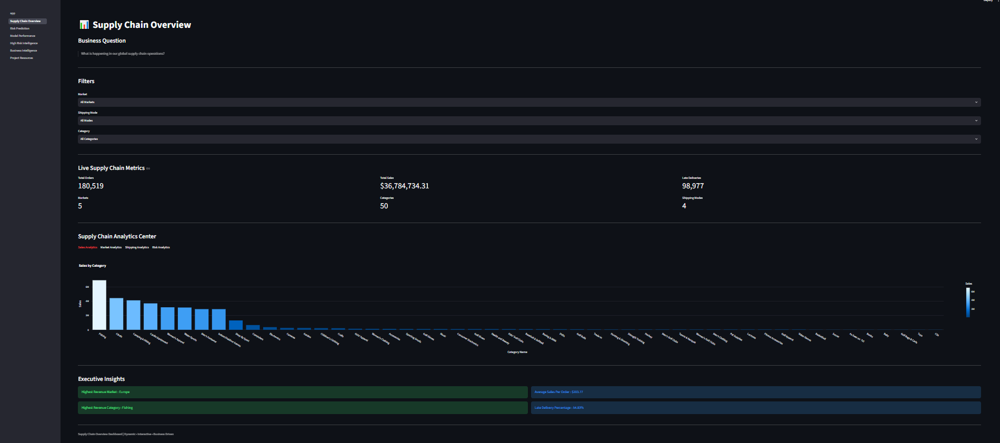
</p>

---

### Late Delivery Risk Prediction

> Predicts the likelihood of delivery delays using Machine Learning models and generates business recommendations based on prediction confidence scores.

<p align="center">
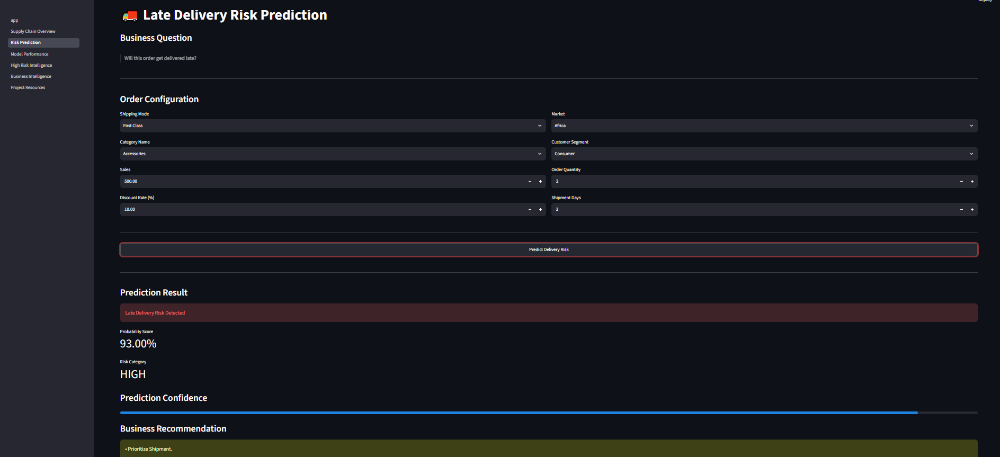
</p>

---

### Model Performance Dashboard

> Compares Machine Learning models using evaluation metrics and automatically identifies the best-performing model.

<p align="center">
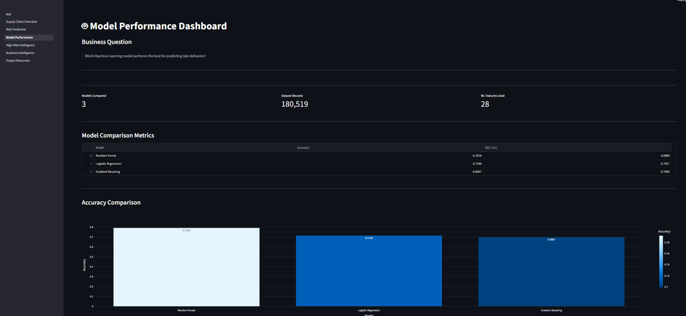
</p>

---

### High Risk Intelligence Center

> Identifies major contributors to delivery delays across markets, categories, and shipping strategies.

<p align="center">
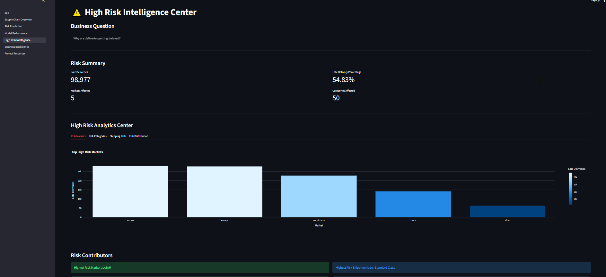
</p>

---

### Business Intelligence Dashboard

> Generates executive-level business insights and actionable recommendations for supply chain optimization.

<p align="center">
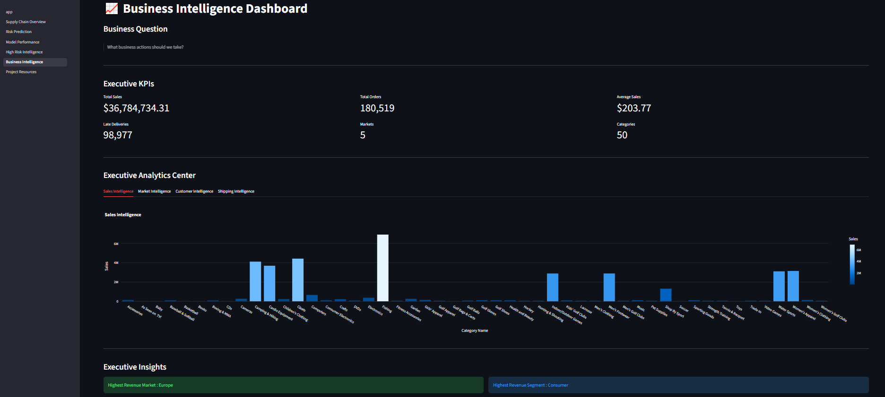
</p>

---

### Project Resources Center

> Provides centralized access to datasets, models, reports, visualizations, and downloadable project resources.

<p align="center">
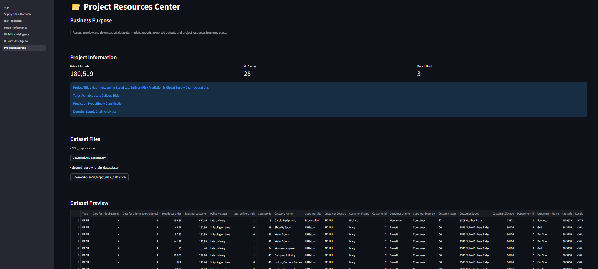
</p>

---

## 📁 Project Structure

```text
Supply-Chain-Late-Delivery-Risk-Prediction
│
├── data/
│      ├── APL_Logistics.csv
│      └── cleaned_supply_chain_dataset.csv
│
├── exports/
│      ├── feature_importance.csv
│      ├── high_risk_orders.csv
│      ├── kpi_summary.csv
│      ├── late_delivery_probability.csv
│      ├── model_metrics.csv
│      ├── risk_category_distribution.csv
│      └── top15_features.csv
│
├── graphs/
│      └── Project Visualizations
│
├── models/
│      ├── random_forest.pkl
│      ├── logistic_regression.pkl
│      ├── gradient_boosting.pkl
│      └── preprocessor.pkl
│
├── pages/
│      ├── Supply Chain Overview
│      ├── Risk Prediction
│      ├── Model Performance
│      ├── High Risk Intelligence
│      ├── Business Intelligence
│      └── Project Resources
│
├── reports/
│      └── Project Reports
│
├── app.py
├── requirements.txt
└── README.md
```

---
## ⚙️ Installation & Usage Guide

## ⚠️ Important Notice

Project Requirements

Before running the application, ensure the following
resources are available locally:

• data/
    - APL_Logistics.csv
    - cleaned_supply_chain_dataset.csv

• models/
    - random_forest.pkl
    - logistic_regression.pkl
    - gradient_boosting.pkl
    - preprocessor.pkl

No additional configuration is required once these files are placed in their respective folders.

The following files are automatically accessed:

### Dataset Files

- cleaned_supply_chain_dataset.csv
- APL_Logistics.csv


### Machine Learning Models

- random_forest.pkl


The following resources are available locally within the repository:

- preprocessor.pkl
- logistic_regression.pkl
- gradient_boosting.pkl
- exported outputs
- reports
- graphs
- screenshots


All required files are organized within the project structure.

Ensure the datasets and model files are present in their respective folders before running the application.


### 1. Clone the Repository

```bash
git clone <YOUR_GITHUB_REPOSITORY_LINK>

cd Supply-Chain-Late-Delivery-Risk-Prediction
```

### 2. Create a Virtual Environment

```bash
python -m venv venv
```

### 3. Activate the Virtual Environment

#### Windows

```bash
venv\Scripts\activate
```

#### macOS / Linux

```bash
source venv/bin/activate
```

### 4. Install Required Libraries

```bash
pip install -r requirements.txt
```

### 5. Launch the Streamlit Application

```bash
streamlit run app.py
```

### 6. Open Your Browser

```text
http://localhost:8501
```

The interactive dashboard will automatically launch and provide access to all project modules.

---
## 🔮 Future Improvements

The current implementation can be further enhanced through:

- Real-Time Delivery Risk Prediction.
- Cloud Deployment and API Integration.
- Automated Risk Alert Systems.
- Live Supply Chain Monitoring.
- Advanced Demand Forecasting Models.
- Generative AI-Based Business Reporting.
- Enterprise-Level Supply Chain Intelligence Solutions.

---
## 👨‍💻 Author

### Bandham Raju

> B.Sc. (Mathematics, Electronics & Computer Science)  
> Data Analyst | Data Science Enthusiast | Machine Learning Practitioner


- LinkedIn: [*www.linkedin.com/in/raju-bandham*](https://www.linkedin.com/in/raju-bandham)
- GitHub: [*github.com/BandhamRaju*](https://github.com/BandhamRaju)
- Email: [*Bandhamraju2@gmail.com*](https://Bandhamraju2@gmail.com)


This project demonstrates the application of Data Science, Machine Learning, Business Intelligence, and Interactive Analytics to solve real-world supply chain challenges through predictive modeling and executive-level decision support systems.

---
## 📜 License

This project is intended for educational, research, and portfolio purposes.

Feel free to fork, explore, and learn from this repository while providing appropriate attribution to the original work.

---
